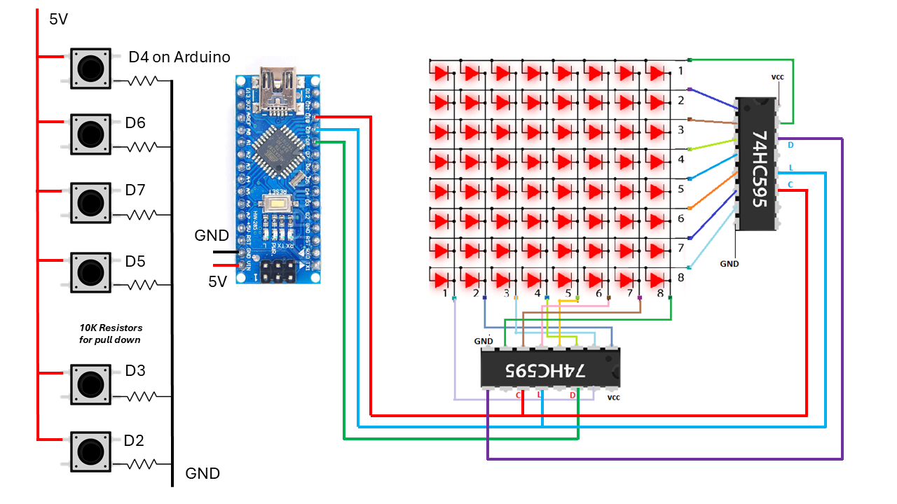
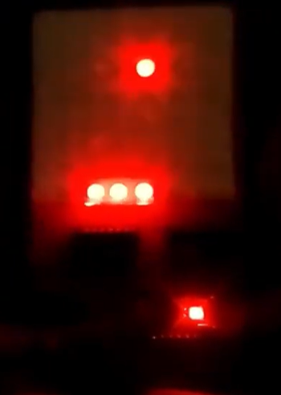
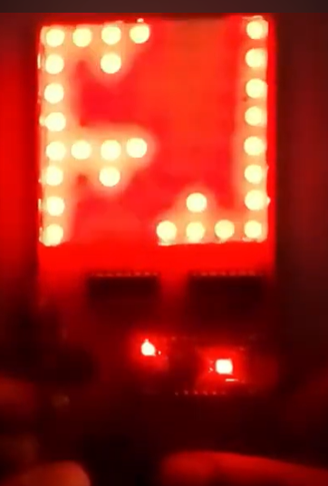
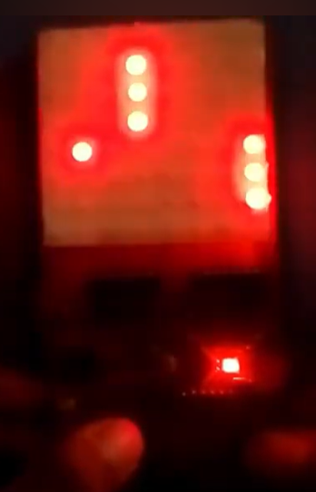
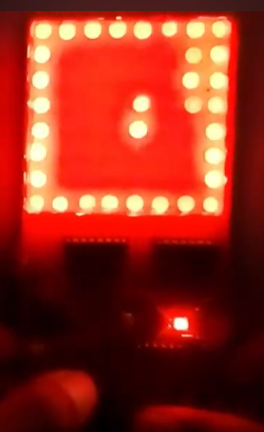
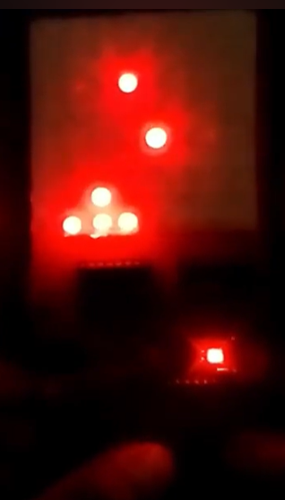
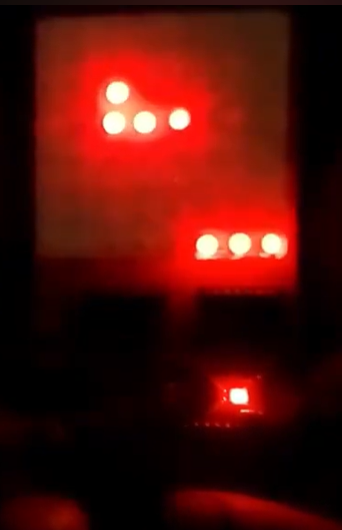

# Arduino Game Boy with 6 Games for 8x8 LED Matrix Panel - Tutorial

## Introduction

This tutorial will guide you through building your own Arduino-based Game Boy that plays 6 different games on an 8x8 LED matrix panel. This compact gaming system is perfect for beginners and experienced makers alike, offering classic game experiences with simple controls.

## Components List

### Electronics Components
- Arduino Uno or compatible board
- 8x8 LED matrix (common anode or cathode - check your specific model)
- 74HC595 shift register (for controlling the LED matrix)
- 10kΩ resistors (6 pieces for pull-down)
- Push buttons (6 pieces for controls)
- Breadboard and jumper wires
- 5V power supply (or USB power from computer)

### Optional Components
- Enclosure/case for your Game Boy
- Battery pack for portable operation
- Speaker or buzzer for sound effects

## Hardware Setup

### Wiring Diagram

1. **LED Matrix Connections**:
   - Connect rows to Arduino pins D2-D7 (6 pins)
   - Columns are controlled via the 74HC595 shift register

2. **74HC595 Shift Register**:
   - VCC to 5V
   - GND to Arduino GND
   - SER (DS) to Arduino D4
   - SRCLK (SHCP) to Arduino D6
   - RCLK (STCP) to Arduino D7

3. **Button Controls**:
   - Each button connects between 5V and an Arduino input pin (with 10kΩ pull-down resistors)
   - Suggested button pins: D8-D13 (6 buttons)

### Schematic Explanation

The system uses multiplexing to control the 8x8 LED matrix with minimal pins:
- The 74HC595 handles column data (8 columns)
- Arduino pins directly control 6 rows (for a 6x8 visible area or with scrolling)
- Buttons provide user input for game controls

## Software Installation

1. Download all the .ino files from the project repository
2. Open the main sketch (Game_Boy.ino) in Arduino IDE
3. Install any required libraries (if the code uses specific LED matrix libraries)
4. Upload the code to your Arduino

## Game Descriptions

This Game Boy includes 6 exciting games:

1. **Ping Pong Game** - A balancing game where you keep a ball stable

2. **Car Game** - A racing or dodging game

3. **Bird Flying Game** - A flying/shooting game

4. **Following Game** - A memory or pattern-following game

5. **Shooting Game** - Target shooting game

6. **Ball Catching Game** - Classic Pong-style game

## How to Use

1. Power on the system
2. The main menu will appear on the LED matrix
3. Use buttons to navigate the menu:
   - Up/Down to select game
   - One button to confirm selection
4. Each game has its own control scheme explained in-game
5. Games display scores and have win/lose conditions

## Customization Options

1. **Difficulty Levels**: Modify game speed variables in the code
2. **New Games**: Add your own games by creating new .ino files following the existing pattern
3. **Display Effects**: Enhance the visual effects by modifying the Display.ino file
4. **Sound**: Add a buzzer for sound effects by connecting to an available digital pin

## Troubleshooting

**LED matrix not lighting up?**
- Check your matrix type (common anode/cathode)
- Verify all connections to the shift register
- Ensure correct pin assignments in the code

**Buttons not responding?**
- Check pull-down resistors are properly connected
- Verify button pins match the code definitions
- Test buttons with simple serial output test

**Games running too fast/slow?**
- Adjust delay() values in the game loops
- Modify frame rate variables in the main code

## Conclusion

You've now built your own Arduino Game Boy with 6 different games! This project combines basic electronics with fun game programming, providing endless opportunities for expansion and customization. Try adding more games, improving the display routines, or creating a custom case for your portable gaming system.

## Further Improvements

1. Add high score saving with EEPROM
2. Implement more sophisticated sound effects
3. Create a PCB for more reliable connections
4. Design a 3D-printed case for a professional look
5. Add a second LED matrix for larger displays

Enjoy your homemade gaming system!
